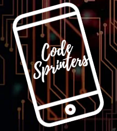

# ECOMMERCE-CODESPRINTERS 

# ESTRUCTURA DEL PROYECTO 

## ¿DE QUE SE TRATA?

Este ecommerce es sobre venta de productos de arte
En un futuro intentaremos seguir creciendo 

## ¿DE DONDE VIENE LA IDEA?

Obtuvimos la idea para este ecommerce tras ponernos en contacto
con un grupo de artistas de San Rafael.
Este grupo llamado Intuisiones esta formado por docentes y Artistas de nuestro Departamento
que a menudo realizan muestras de artes en conjunto, ellos no cuentan con pagina web 
y desean un lugar donde poder vender sus obras, accesible para todos.

## ¿QUE BUSCAMOS?

Buscamos realizar una ecommerse funcional para poder comercializarlo.
En este momento esta funcionando correctamente.
Pretendemos en un futuro agregarle una sección con los perfiles de los artistas
que se registren en nuestra aplicación, para que el cliente pueda conocerlos mejor 

## GUIA PARA CORRER EL PROYECTO 

Para correr este proyecto deberas seguir las instrucciones de los dos archivos tipo README.md 
ubicados,uno en la sección de nuestro codigo Frontend y otro en la sección de nuestro codigo Backend.

Rutas de acceso
* Frontend /ECOMMERCE-CODESPRINTERS/frontend/README.md
* Backend  /ECOMMERCE-CODESPRINTERS/src/README.md

## Links de los Programas que necesitas 

 [Node.js](https://nodejs.org/en/)

 [REACT](https://es.react.dev)

 [postgresql](https://www.postgresql.org)

 [jwt](https://www.postgresql.org)

## LINK DEL REPOSITORIO 

- [@ECOMMERCE-CODESPRINTERS](https://github.com/CodeStrong2023/ecommerce-codesprinters)
 
## ¿QUIENES SOMOS?

   Somos un grupo de estudiantes de U.T.N San Rafael Tec.En programación
   te podes contantar con nosotros atravez de nuentros perfiles 

- [@Matias Moyano](https://github.com/matiasnmoyano)
- [@Ferrero Genaro](https://github.com/GENAROENZO)
- [@Francisco Corvalan](https://github.com/Francorvalan1212)
- [@Joaquin Agüero](https://github.com/aguero101)
- [@Juan Barrera](https://github.com/Juanbarrera12)