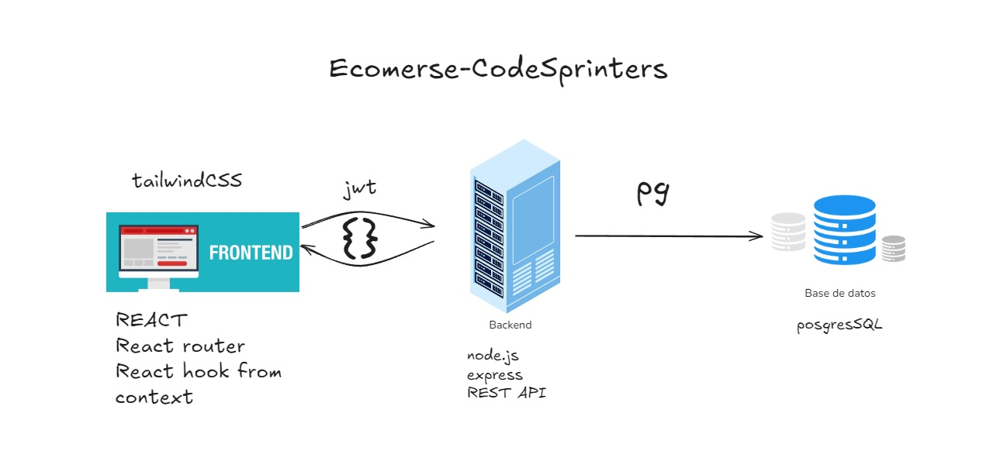

# README BACKEND 

## Pasos a seguir 

PASOS PARA INTALAR EL BACKEND

* Clonar el repositorio en tu pc
* Inicializar el proyecto  npm -y init (para generar un pakage json)
* Instalar las dependencias npm i bcrypt cookie-parser express ... etc

Crear el Servidor en PosgresSQL

*  Dirigirse al archivo database/ini.sql
*  En una queery del servidor correr los comandos que se encuentran en ese archivo

Revisar la configuracion del Servidor local

* Dirigirse al archivo server/src/router/config.js 
* Revisar que en ese archivo las caracteristicas de tu servidor locar coincidan 
* Si no coinciden cambiarlas 

Levantar el BACKEND de forma local 

* En la terminal ruta  ecommerse-codesprinters:  tirar el comando :  npm run dev 

## Repositorio del Proyecto

- [@Codesprinters](https://github.com/CodeStrong2023/ecommerce-codesprinters)

## Dependencias 

Para podes correr el bakend vas a necesitar instalar las siguientes Dependencias

    "bcrypt"
    "cookie-parser"
    "express"
    "express-promise-router"
    "jsonwebtoken"
    "md5"
    "morgan"
    "pg"
    "server"
    "zod"
  
  "devDependencies"

    "eslint"
    "nodemon"
    

## Contribuyentes 

- [@Matias Moyano](https://github.com/matiasnmoyano)
- [@Ferrero Genaro](https://github.com/GENAROENZO)
- [@Francisco Corvalan](https://github.com/Francorvalan1212)
- [@Joaquin Agüero](https://github.com/aguero101)
- [@Juan Barrera](https://github.com/Juanbarrera12)

# Estructura del proyecto 

* Links de los programas usados 

 [Node.js](https://nodejs.org/en/)

 [REACT](https://es.react.dev)

 [postgresql](https://www.postgresql.org)

 [jwt](https://www.postgresql.org)